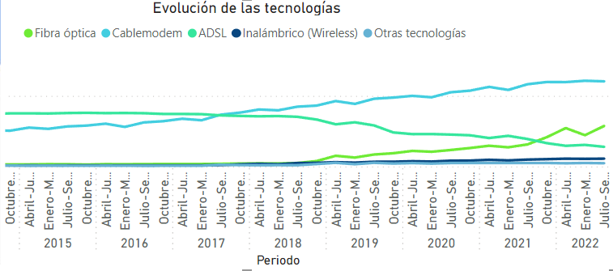
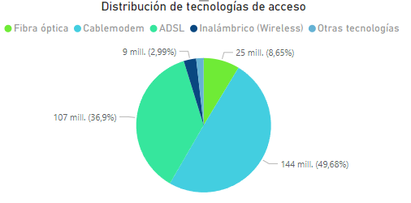
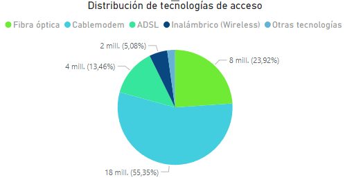

# ENACOM Telecomunicaciones
La industria de las telecomunicaciones ha jugado un papel vital en nuestra sociedad, facilitando la información a escala internacional y permitiendo la comunicación contínua incluso en medio de una pandemia mundial. La transferencia de datos y comunicación se realiza en su mayoría a través de internet, líneas telefónicas fijas, telefonía móvil y en casi cualquier lugar del mundo.

En comparación con la media mundial, Argentina está a la vanguardia en el desarrollo de las telecomunicaciones, teniendo para el 2020 un total de 62,12 millones de conexiones.

Una una empresa prestadora de servicios de telecomunicaciones requiere la realización de un análisis completo que permita reconocer el comportamiento de este sector a nivel nacional. Se tiene como objetivo orientar a la empresa para brindar una buena calidad en sus servicios, identificando oportunidades de crecimiento y poder plantear soluciones personalizadas a sus posibles clientes.

La presente es un proyecto de de análisis exploratorio de datos y visualización de la información recuperada de los datos abiertos que ofrece ENACOM[^1] en el ámbito de las telecomunicaciones de Argentina.

## Índice
1. [Objetivos ](#id1)
4. [KPI's](#id2)
2. [Fuentes de datos](#id3)
3. [EDA - Análisis Exploratorio de Datos](#id4)
5. [Conlusiones](#id5)

## 1. Objetivo

 - Analizar la situación actual del sector de telecomunicaciones en Argentina, con el fin de identificar oportunidades de crecimiento y mejora en la calidad del servicio de conectividad a internet.

## 2. KPI's
Como idicadores claves de desempeño se han establecido los siguientes:

>[!IMPORTANT]
>
>Impulsar la demanda de servicio de internet (en cualquier tecnología) en ciudades con potenciales clientes, en el período de un año.

>[!IMPORTANT]
>
>Expandir la tecnología de fibra óptica a todas las ciudades capitales de Argentina que aún no lo possen en el término de dos años.

>[!IMPORTANT]
>
>Mejorar la velocidad de conexion a internet... (en desarrollo).

## 2. Fuente de datos
Se detallan las fuentes de datos obligatorias y complementarias utilizadas.

### 2.1. Datasets utilizados
Se hacen uso de los siguientes datas:

[Acceso de internet por tecnologías](datasets/Internet_Accesos-por-tecnologia.csv) y 
[acceso de internet por tecnologia y provincia](datasets/Internet_Accesos-por-tecnologiayporprovincia.csv)
Se analizaron estos datas con el fin de evaluar la situación actual de las telecomunicaciones en Argentina, al menos d elos ultimos registros datan del año 2022, 3er trimestr(Julio-Septiembre). 

[conectividad de internet](datasets/ConectividadalserviciodeInternet.csv) y [listado de localidades con conectividad a internet](datasets/Listadodelocalidadesconconectividadainternet.csv)
Con el fin de responder a nuestros KPI's se exploró este dataset, identificando oprotunidades de crecimiento. 

### 2.2. Fuentes adicionales
[listado de provincias](datasets/provincias.csv)
Se indagó este dataset en particular para obtener información acerca de la ubicación geográfica de cada provincia, mediante sus datos de latitud y longitud.

### 2.3. Diccionario de datos: metadatos
| Nombre del campo | Descripción |
| --- | --- |
| dt | tipo de recurso: conjunto de datos. |
| ds | tipo de recurso: vistas. |
| vz | tipo de recurso: visualizaciones. |
| db | tipo de recurso: colecciones. |
| guid | Identificador del recurso. |
| title | Título del conjunto de datos. |
| description |  Descripción del conjunto de datos. |
| categories | Nombre de la categoría. |
| endpoint |  Url apuntando al recurso con los datos (archivos o página web). |
| tags |  Opcional. Tags separados por coma. |
| user |  Usuario que publica el recurso. |
| parameters |  Parámetros que tiene el recurso. |
| created_at |  Fecha de creación de la versión del recurso. |
| link |  Link a la vista del recurso en el portal. |

## EDA - Análisis Exploratorio de Datos
Se realizó el análisis explotatorio de los datos para cada uno de los datasets previamente descargados en formato CSV. En cada eda, se analizan los datos, se describen los mismos, detectando outliers sin eliminarlos, se sigue por la descripción de la distribución de sus datos y se ofrecen visualizaciones que contribuyen a la labor de conclusiones que sean útiles para los indicadores de rendimientos y la toma de decisiones oportunas en la cumplimentación del objetivo propuesto-

## Conclusiones

En base a lo analizado, se concluye que **el servicio de internet más contratado es la modalidad de cable modem** y la minoría se representa por la categoría otros. 

  

Se observa que **a lo largo de los años, hubo un mayor crecimiento en la demanda de tecnología de acceso de internet por cable modem, con un 50% y fibra óptica con 37%**, no asi, en el caso de ADSL, que fue decreciendo. En sus inicios la modalidad que inicio fuertemente fue ADSL con cable modem, pero dado el último año (2022) se registra que la prominente es cabla módem (55%) y le sigue fibra óptica (24%).

En cuando a la categoria "otros", según la fuente del ENACOM[^2] y la exploración de la conectividad en el servicio de internet, en esta modalidad pueden incluirse los contratados por acceso telefónico (Dial-Up), acceso por red de telefonía móvil con 3G y 4G, y el acceso por linea eléctrica.

Se recomienda eliminar los registros de la categoría otros para casos en que quiera aplicarse modelos predictivos, pues tienen muy pocos datos de esa clase y no se tiene la certeza a que tipo de tecnologia de acceso de internet corresponde.

## Referencias

[^1]: El Enacom es un ente autárquico y descentralizado que funciona en el ámbito de la Jefatura de Gabinete de Ministros de la Nación Argentina. Su objetivo es conducir el proceso de convergencia tecnológica y crear condiciones estables de mercado para garantizar el acceso de todos los argentinos a los servicios de internet, telefonía fija y móvil, radio, postales y televisión.Enacom fue creado en Diciembre del 2015 a través del Decreto 267 en el cual se establece su rol como regulador de las comunicaciones con el fin de asegurar que todos los usuarios del país cuenten con servicios de calidad. Fuente: https://enacom.gob.ar/

[^2]: Tipos de acceso a internet https://www.enacom.gob.ar/tipos-de-conexion_p112

Notas para tener en cuenta mñas adelante: no se eliminan los outliers porque no hay procesos sobre los datos, analisis o visualizacion de datos que lo requeira.
https://datos.gob.ar/dataset/jgm-servicio-normalizacion-datos-geograficos/archivo/jgm_8.26
se obtuvo datas adicionales